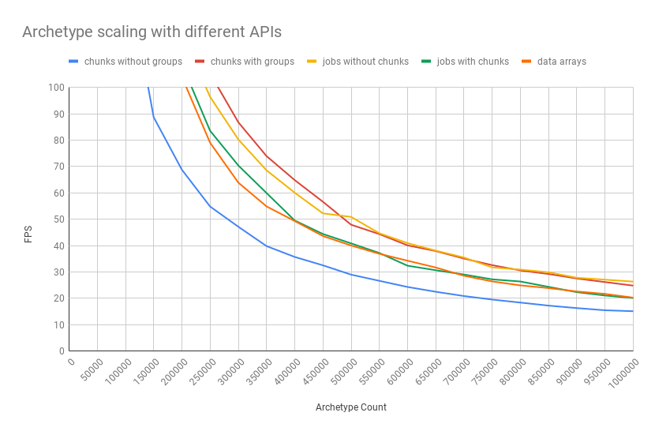

# Archetype scaling with different APIs

Kudos: [samiwh](https://github.com/samiwh)

* Unity 2018.2.14f1
* Intel(R) Xeon(R) W-2195 CPU @ 2.30GHz, 2304 Mhz, 18 Core(s), 36 Logical Processor(s)
* 64 GB RAM
* GTX 1080

Built out player: windowed, 640x480 resolution, very low quality graphics

## Built out player
